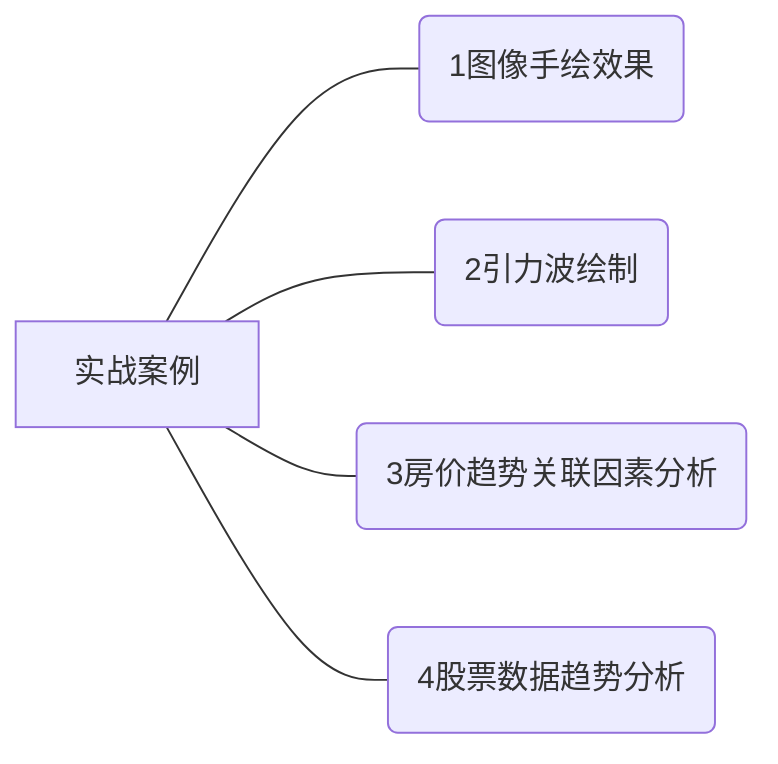
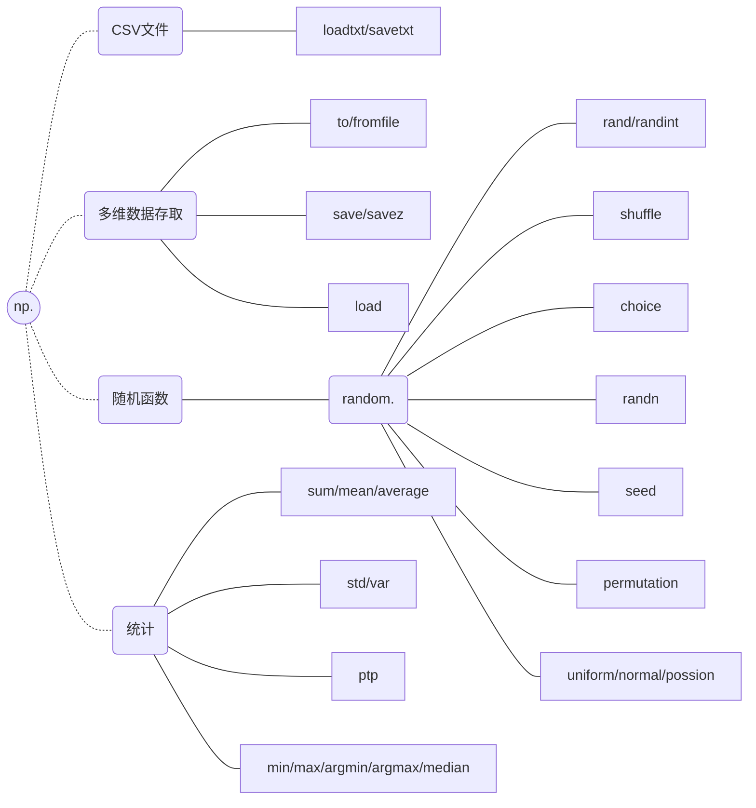

# Python数据科学

[TOC]




## Ipython

[IPython](http://ipython.org)

[nbviewer](https://nbviewer.ipython.org/)：展示网络上任何可用的IPythonNotebook静态翻译 

> *The front page features some example notebooks that you can browse to see what other folks are using IPython for!*

[Intersting IPython NoteBook](https://github.com/ipython/ipython/wiki/A-gallery-of -interesting-IPython-Notebooks)：nbviewer上运行最全的Notebook列表

- 帮助&文档

  每个Python对象均有一个字符串的引用，即docstring。`help()`获取字符串包含对象的简要介绍及使用方法，`?`获取文档和相关信息，`??`获取源代码
  
  > 上述方法支持自定义函数&其他对象
  >
  > 
  
- 输入补全@Tab

  > 通配符匹配：
  >
  > ```python
  > >> *Warning?   #给出所有Waring结尾所有对象
  > BytesWarning
  > DeprecationWarning
  > FutureWarning
  > ImportWarning
  > PendingDeprecationWarning
  > ResourceWarning
  > RuntimeWarning
  > SyntaxWarning
  > UnicodeWarning
  > UserWarning
  > Warning
  > 
  > >> list.*rt*?
  > list.insert
  > list.sort
  > ```
  
- %魔术命令

  |     常用命令      | 说明                                |
  | :---------------: | ----------------------------------- |
  |    %[ls]magic     | 显示所有魔术命令                    |
  |       %hist       | IPython输入历史                     |
  |       %pdb        | 异常发生后进入调试器                |
  |    **%reset**     | 删除当前命名空间所有定义的变量      |
  |     **%who**      | 显示IPython当前命名空间已定义变量   |
  |  %time statement  | 代码执行时间，statement表示一端代码 |
  | %timeit statement | 多次执行代码并计算综合执行时间      |
  |    **%clear**     | 清屏                                |
  |  %run <filename>  | 执行代码                            |
  
  > `%timeit`后的代码长一行，若想多行代码，使用单元魔法`%%`
  
- 快捷键

  | Ctrl+a | 光标移到本行开始   |
  | :----: | ------------------ |
  | Ctrl+b | 光标回退一格       |
  | Ctrl+c | 中断当前Python命令 |
  | Ctrl+d | 删除后一个字符     |

- In/Out变量：Ipython中In变量为==列表==，记录所有的输入命令；Out为==字典==，记录输出

- 禁止输出：结尾加分号（且结果不会被保存在Out中）

- 调试

  [ipdb在线文档](https://github.com/gotcha/ipdb)

  发生异常时可使用`%debug`调用ipdb（*pdb为Python调试器，ipdb为IPython增强版*）

  希望在发生任何异常时均启用调试器

  ```python
  %xmode Plain
  pdb on
  ..... #运行对应代码
  ```

  交互式运行代码`%run -d`

  |    list    | 显示文件当前路径       |
  | :--------: | ---------------------- |
  |   h(elp)   | 查找特定命令帮助       |
  |   q(uit)   | 退出调试器和程序       |
  | c(ontinue) | 仅退出调试器，继续运行 |
  |   n(ext)   | 跳到程序下一步         |
  |  p(rint)   | 打印变量               |
  |   s(tep)   | 步入子进程             |
  |  r(eturn)  | 从子进程跳出           |
  |  <enter>   | 重复上一个命令         |

- 代码运行时长&内存分析。。。

## 数学编程-入门

### 处理数字

- 不同类型数字

  ```Python
  >>> type(3+7i)
  SyntaxError: invalid syntax
  >>> type(3+9j)
  <class 'complex'>
  -------------------------
  >>> a=input()
  90
  >>> type(a)
  <class 'str'>
  -------------------------
  >>> try:
  	a =float(input('Enter a number:'))
  except ValueError:
  	print('Entered an invalid number?!')
  
  	
  Enter a number:3-5
  Entered an invalid number?!
  ----------------------------@ValueError
  >>> int('431')
  431
  ----------------------------
  >>> 1.0.is_integer()
  True
  ------------------------------@ZeroDivisionError
  >>> from fractions import Fraction
  >>> Fraction(input())
  45/7890
  Fraction(3, 526)
  ```

  

## NumPy入门

[Numpy相关查询](https://numpy.org/doc/stable/)

### 数据基础操作

- 维度：一组数据的组织形式

  > 一维数据：列表、数组、集合等（列表数据类型可以不同）
  >
  > 二维数据：表格
  >
  > 多维数据：一维或二维在新维度上扩展
  >
  > 高维数据：键值对

- Python的数据类型

  
  
  > *C 整数本质上是内存中某个位置的标签，其字节编码整数值。 Python整数是指向内存中某个位置的指针，该位置包含所有 Python对象信息，包括包含整数值的字节。 Python 整数结构中的这些额外信息使 Python 能够如此自由和动态地编码。 然而，Python 类型中的所有这些附加信息都是有代价的，这在组合了许多这些对象的结构中变得尤为明显。*
  
- NumPy的数组对象：ndarray

  > *Python的标准可变多元素数据变量为list，但当列表中数据类型相同时，每个元素都存储类型信息变得冗余，nadarry更适合同类型数据大容量存储处理*
  
  ```mermaid
  graph LR
  a((NumPy))-.-b(ndarray)
  a-.-c(广播函数功能)
  a-.-d(整合C/C++/Fortran)
  a-.-e(线性代数/傅里叶变换/随机数生成等)
  ```
  
  ```mermaid
  graph LR
  a1((ndarray))
  a1-.-b1(属性)
  b1---.vdim
  b1---.shape
  b1---.size
  b1---.dtype
  b1---.itemsize
  a1-.-c1(创建-方法)
  c1---.concatenate
  c1---.linspace
  c1---.ones/zeros/full\_like\
  a1-.-d1(转换-方法)
  d1---.reshape/resize
  d1---.swapaxes
  d1---.astype
  d1---.tolist
  d1---.flatten
  a1-.-f1(运算-方法)
  f1-.-e1(一元)
  f1-.-g1(二元)
  e1---.abs
  e1---.sqrt/square
  e1---.sign
  e1---.ceil/floor
  e1---.modf
  e1---.sinh...
  e1---.log/log10
  e1---.exp
  g1---.copysign
  g1---.mod
  g1---.maxinum
  g1---.fmax
  ```
  
  ```Python 
  import nummpy as np
  #别名可省略或更改，一般用np
  ```
  
  > 为何有列表还需要数组对象（类型）？
  >
  > - 可去掉元素箭运算所需循环
  > - 经过优化，可提升运算速度
  > - 采用**相同数据类型**，有助于节省运算和存储空间
  > - 类似定义一个矩阵类型的变量

```Python
In[]:a =np.array([[0,1,2,3,4],[9,8,7,6,5]])
In[]:a
Out[13]: 
array([[0, 1, 2, 3, 4],
       [9, 8, 7, 6, 5]])
In[]:print(a)
[[0 1 2 3 4]
 [9 8 7 6 5]]
```

|   属性    | 说明                                      |
| :-------: | ----------------------------------------- |
|   .ndim   | 秩，维度的数量                            |
|  .shape   | ndarray对象的尺度                         |
|   .size   | ndarray对象元素的个数                     |
|  .dtype   | ndarray对象的元素类型                     |
| .itemsize | ndarray对象中每个元素的大小，字节为单位   |
|  .nbytes  | ndarray对象总的字节大小（=itemsize *size) |

```Python
a.shape
Out[6]: (2,5)
a.dtype
Out[7]: dtype('int32')
a.ndim
Out[8]: 2
```

#### 数组元素类型`dtype`

|                    bool                    |  float16   |
| :----------------------------------------: | :--------: |
| intc(与C语言int类型一致，一般int32或int64) |  float32   |
|             intp(用于索引整数)             |  float64   |
|                    int8                    |   uint8    |
|                   int16                    |   uint16   |
|                   int32                    |   uint32   |
|                   int64                    |   uint64   |
|                 complex64                  | complex128 |

> ndarray数组可由非同质对象组成
>
> 
>
> 非同质ndarray对象无法有效发挥NumPy优势

#### 数组创建

- Python列表、元组等类型创建ndarray数组

  ```python
  x = np.array(list/tuple,<dtype=object>)
  ```

  

- 使用NumPy中函数创建数组**`arange`,`ones`,`eye`,`zeros`**等

  ```Python
  >>> import numpy as np
  >>> np.arange(5)
  array([0, 1, 2, 3, 4])
  >>> np.ones((3,4))
  array([[1., 1., 1., 1.],
         [1., 1., 1., 1.],
         [1., 1., 1., 1.]])
  >>> np.zeros((2,3),dtype=np.int32)
  array([[0, 0, 0],
         [0, 0, 0]])
  >>> np.eye(3)
  array([[1., 0., 0.],
         [0., 1., 0.],
         [0., 0., 1.]])
  >>> x=np.ones((2,3,4))
  >>> print(x)
  [[[1. 1. 1. 1.]
    [1. 1. 1. 1.]
    [1. 1. 1. 1.]]
  
   [[1. 1. 1. 1.]
    [1. 1. 1. 1.]
    [1. 1. 1. 1.]]]
  >>> x.shape
  (2, 3, 4)
  ```

  |    np.ones_like(a)     |                                              |
  | :--------------------: | -------------------------------------------- |
  |    np.zeros_like(a)    |                                              |
  | np.full[_like] (a,val) | 根据数组a形状生成一个数组，每个元素值为`val` |
  |     np.linspace()      | 根据起止数据等间距填充（类似MATLAB）         |
  |    np.concatenate()    | 将两个或多个数组合并为一个新数组             |

- 字节流中创建ndarray数组

  文件中读取特定格式，创建ndarray数组

  - `frombuffer（buffer）`：将缓冲区转换为 `1` 维数组。
  - `fromfile（file，dtype，count，sep）`：从文本或二进制文件中构建多维数组。
  - `fromfunction（function，shape）`：通过函数返回值来创建多维数组。
  - `fromiter（iterable，dtype，count）`：从可迭代对象创建 `1` 维数组。
  - `fromstring（string，dtype，count，sep）`：从字符串中创建 `1` 维数组。

#### 数组变换

> 对于创建后ndarray数组，可进行维度变换和元素类型变换
>
> `a =np.ones((2,3,4),dtype =np.int32)`

|      .reshape(shape)       | 不改变数组元素，返回shape形状数组            |
| :------------------------: | -------------------------------------------- |
|       .resize(shape)       | 同上，修改原数组                             |
|     .swapaxes(ax1,ax2)     | 数组维度调换                                 |
|        .flatten( )         | 降维，返回折叠后一维数组，不改原数组         |
|     .astype(new_type)      | 转换数据类型                                 |
|         .tolist()          | 数组转换列表                                 |
| np.ravel(ndarray,<order=>) | 数组展开为一行，默认`C`按行展开；`F`按列展开 |

#### 数组索引&切片

```Python
>>> a= np.array([9,8,7,6,5,4])
>>> a[2]
7
>>> a[::-1]
array([4, 5, 6, 7, 8, 9])
>>> b =np.arange(24).reshape((2,3,4))
>>> b 
array([[[ 0,  1,  2,  3],
        [ 4,  5,  6,  7],
        [ 8,  9, 10, 11]],

       [[12, 13, 14, 15],
        [16, 17, 18, 19],
        [20, 21, 22, 23]]])
>>> b[-1,-2,-3]
17
```

- `np.concatenate((a1, a2, ...), axis)`：数组拼接。`axis<default =0>`为连接轴，对矩阵来说即0为列，1为行

  `np.vstack`，`np.hstack`，`np.dstack`分别为垂直栈拼接（axis=0），水平栈拼接（axis=1），第三维度拼接（axis=2）

#### 数组运算

- 向量操作

  *Python 的默认实现（称为 CPython）执行某些操作非常缓慢。这部分是由于语言的动态、解释性质——类型是灵活的，因此操作序列不能像在 C 和 Fortran 之类的语言中那样编译成高效的机器代码*

  - 一元函数

    *加减乘除取模指数等与对应符号相同*

  |   np.abs(x)/np.fabs(x)   | 数组各元素绝对值                 |
  | :----------------------: | -------------------------------- |
  |        np.sqrt(x)        | 数组各元素平方根                 |
  |       np.square(x)       | 数组各元素平方                   |
  | np.log(x)/np.log10(x)/.. | 数组各元素自然对数，10底对数。。 |
  |  np.ceil(x)/np.floor(x)  | 向上取整、向下取整               |
  |        np.rint(x)        | 四舍五入                         |
  |        np.modf(x)        | 分离整数与小数部分               |
  | np.cos(x)/np.sinh(x)/..  | 三角函数                         |
  |        np.exp(x)         | 指数值                           |
  |        np.sign(x)        | 符号值`1(+)`,`0`,`-1(-)`         |

  > .fabs()仅适用于int与float，不适用于complex
  >
  > ```python
  > np.modf(3.14)
  > Out: (0.14000000000000012, 3.0)
  > 
  > a =np.arange(10).reshape(2,5)
  > b =np.arange(2,12).reshape(2,5)
  > np.mod(b,a)
  > __main__:1: RuntimeWarning: divide by zero encountered in remainder
  > Out: 
  > array([[0, 0, 0, 2, 2],
  >     [2, 2, 2, 2, 2]], dtype=int32)
  > ```

  - 二元函数

    |           + - * / **            | 各元素进行运算     |
    | :-----------------------------: | ------------------ |
    | np.maxinum(x,y)/np.mininum(x,y) | 元素级比较         |
    |       np.fmax()/np.fmin()       | 结果为浮点数       |
    |           np.mod(x,y)           | 元素级模运算       |
    |        np.copysign(x,y)         | y各元素符号赋值给x |
    |         > < >= <= == !=         | 算数比较           |

  - 专用函数@`scipy`

    [Python机器学习及分析工具：Scipy篇](https://www.jianshu.com/p/6c742912047f)

    

  - 通用函数高级特性

    - 指定输出`out`：指定计算结果存放位置

      ```python
      In: x =np.arange(5)
          y =np.zeros(10)
          np.power(2,x,out =y[::2])
          print(y)
      Out:[ 1.  0.  2.  0.  4.  0.  8.  0. 16.  0.]
      ```

      > 如果写的是`y[::2] = 2**x`，那将创建一个临时数组存放该结果再赋值到y中，对上述例子来说差别不大，但数据量较大时可以通过慎重使用out节约内存

    - 聚合`reduce`：对数组的元素重复应用给定的操作，直到只剩下一个结果，适用于二元函数

      ```python
      x =np.arange(1,6)
      np.multiply.reduce(x)
      Out[26]: 120
      ```

      > 在一些情况中，Numpy给出了专用的函数如`np.sum`，`np.prod`，`np.cumsum`等也可实现

    - 外积`outer`：两个数组之间所有元素对的操作

      ```python
      np.multiply.outer(x,x)
      Out[27]: 
      array([[ 1,  2,  3,  4,  5],
             [ 2,  4,  6,  8, 10],
             [ 3,  6,  9, 12, 15],
             [ 4,  8, 12, 16, 20],
             [ 5, 10, 15, 20, 25]])
      ```

    - [广播](####广播)

### 数据存取与函数




#### CSV文件存取（Comma-Seperated Value）

`np.savetxt(frame,array,fmt='%.18e',delimiter=None)`

- `frame`：文件、字符串或产生器，可以为`.gz`或`.bz2`的压缩文件
- `array`：存入文件的数组
- `fmt`：写入文件格式
- `delimiter`：分割字符串，默认任意空格

`np.loadtxt(frame,dtype=np.float,delimiter=None,unpack=False)`

- `frame`：同上
- `dtype`：数据类型，可选
- `delimiter`：分割字符串，默认任意空格
- `unpack`：若为True，将对输出转置

> `np.savetxt()`与`np.loadtxt()`只能有效存取一维和二维数组

#### 多维数据存取

`a.tofile(frame,sep='',format='%s')`

- `frame`：文件、字符串
- `sep`：数据分割字符串，若为空串，写入文件为二进制
- `format`：写入数据格式


`a.fromfile(frame,dtype=float,count=-1,sep='')`

- `sep`：数据分割字符串，若为空串，写入文件为二进制
- `count`：读入元素个数，若为-1表示读入整个文件

#### NumPy便捷文件存取

`np.save(fname,array)`或`np.savez(fname,array)`或`np.load(frame)`

- `frame`：文件名，以`.npy`为扩展名，压缩扩展名为`.npz`
- `array`：数组变量

> np.save(‘a.npy’,a)
> save主要保存.npy文件.但是.npy文件不能追加数据，也就是说在创建的同时需要将数据一次性的输入，之后不能再向文件中添加数据。
>
> np.savez(‘a.npz’,ar0=a,ar1=b)
> savez主要保存.npz文件，但是它可以将多条数据同时压缩到一个.npz 文件中。同样地，虽然savez可以保存多条数据，但是也不可追加数据，即在创建文件时，就要将需要输入的多个数据同时输入并保存，之后不可再向文件中添加数据。
>
> np.savetxt(‘a.txt’,a)
> savetxt只要将数据保存为txt文件，和前两个不同，它可以再次对文件操作，但是对已有数据的文件再次使用savetxt（），并不会将数据追加在后面，而是将之前数据覆盖。

#### NumPy的随机数函数（random子库，`np.random.*`）

|     rand(d0,d1,...dn)      | d为维数，创建随机数浮点数组【0,1）                           |
| :------------------------: | ------------------------------------------------------------ |
|    randn(d0,d1,...,dn)     | 标准正态分布                                                 |
| randint(low[,high,shape])  | 根据shape创建随机数组，范围【0,low)【low,high）              |
|          seed(s)           | 随机数种子                                                   |
|         shuffle(a)         | 根据a的第一列进行排列，改变数组                              |
|       permutation(a)       | 同上但不改变数组                                             |
| choice(a[,size,replace,p]) | 从一维数组a中以概率p抽取元素形成size形状数组，replace表示是否可以重用元素，默认True |
|   uniform(low,high,size)   | 产生具有均匀分布数组，size为形状                             |
|   normal(loc,scale,size)   | 正态分布数组，loc均值，scale标准差                           |
|     possion(lam,size)      | 产生泊松分布数组，lam随机时间发生率                          |

```Python
>>> a =np.random.randint(100,200,(3,2))
>>> a
array([[149, 168],
       [174, 141],
       [128, 104]])
>>> np.random.shuffle(a)
>>> a
array([[174, 141],
       [128, 104],
       [149, 168]])
----------------------------------------------
#从大小为3的np.arange（5）生成均匀的随机样本：
>>> np.random.choice(5, 3)
array([0, 3, 4]) 
#This is equivalent to np.random.randint(0,5,3)
#从大小为3的np.arange（5）生成非均匀随机样本：
>>> np.random.choice(5, 3, p=[0.1, 0, 0.3, 0.6, 0])
array([3, 3, 0])
#从大小为3的np.arange（5）生成一个均匀的随机样本，而无需替换：
>>> np.random.choice(5, 3, replace=False)
array([3,1,0])
#This is equivalent to np.random.permutation(np.arange(5))[:3]
#从大小为3的np.arange（5）生成非均匀随机样本，而无需替换：
>>> np.random.choice(5, 3, replace=False, p=[0.1, 0, 0.3, 0.6, 0])
array([2, 3, 0])
#可以使用类似任意数组的形式重复上述操作，而不仅仅是整数。例如：
>>> aa_milne_arr = ['pooh', 'rabbit', 'piglet', 'Christopher']
>>> np.random.choice(aa_milne_arr, 5, p=[0.5, 0.1, 0.1, 0.3])
array(['pooh', 'pooh', 'pooh', 'Christopher', 'piglet'],dtype='<U11')
```

#### Numpy的统计函数（`np.*`）

|         sum(a,axis=None)          | 给定周axis计算数组a相关元素之和，axis为整数或元组 |
| :-------------------------------: | ------------------------------------------------- |
|         mean(a,axis=None)         | 计算期望                                          |
| average(a,axis=None,weights=None) | 计算加权平均值                                    |
|         std(a,axis=None)          | 计算标准差                                        |
|         var(a,axis=None)          | 计算方差                                          |
|           min(a)/max(a)           | 计算最小/最大值                                   |
|        argmin(a)/argmax(a)        | 计算最小值，最大值的降一维后下标                  |
|    unravel_index(index,shape)     | 根据shape将一维下标index变为多维下标              |
|              ptp(a)               | 最大最小值之差                                    |
|             median(a)             | 中位数                                            |

```python
>>> a =np.arange(15).reshape(3,5)
>>> a
array([[ 0,  1,  2,  3,  4],
       [ 5,  6,  7,  8,  9],
       [10, 11, 12, 13, 14]])
>>> np.sum(a)
105
>>> np.mean(a,axis=0)
array([5., 6., 7., 8., 9.])
>>> np.mean(a,axis=1)
array([ 2.,  7., 12.])
>>> np.average(a,axis=0,weights=[2,5,2])
array([5., 6., 7., 8., 9.])
>>> np.var(a)
18.666666666666668
>>> np.max(a)
14
>>> np.unravel_index(np.argmax(a),a.shape)
(2, 4)
```

#### NumPy梯度函数

`np.gradient(f)`

计算数组f中元素梯度，f为多维是，返回每个维度梯度

```Python
>>> a=np.random.randint(0,20,(5))
>>> a
array([13,  5,  3, 15,  9])
>>> np.gradient(a)
array([-8., -5.,  5.,  3., -6.])#二阶，保证了梯度后size不变
```

### 广播、布尔掩码、索引、排序、结构化数组

#### 广播

*不同大小数组的通用函数规则，类比矩阵与标量运算的扩展*


- 规则

  - 如果两个数组的维数不同，则**维数较少**的数组的形状在其前导（左侧）填充 1。
  - 如果两个数组的形状在任何维度上都不匹配，则将该维度中**形状等于 1 的数组拉伸**以匹配另一个形状。
  - 如果在任何维度上大小不一致且都不等于 1，则会引发错误。

  ```python
  In: M =np.ones((3,2))
  In: a =np.arange(3)
  In: M+a
  Traceback (most recent call last):
    File "<ipython-input-34-2267d2681641>", line 1, in <module>
      M+a
  ValueError: operands could not be broadcast together with shapes (3,2) (3,) 
      
  In: M+a[:,np.newaxis]
  Out: 
  array([[1., 1.],
         [2., 2.],
         [3., 3.]])
  ```

  > `newaxis`就是一个插入新维度的函数，且插入的这一维的长度是1。

- 应用

  - 数据归一化

    ```python
    X =np.random.random((10,3))
    Xmean =X.mean(0)
    Xmean
    Out: array([0.5055392 , 0.67941105, 0.40726202])
    X_centered =X-Xmean
    X_centered.mean(0)
    Out: array([9.99200722e-17, 2.22044605e-17, 5.55111512e-18])
    ```

  - 二维函数

    ```python
    import numpy as np
    import matplotlib.pyplot as plt
    x =np.linspace(0,5,50)
    y =np.linspace(0,5,50)[:,np.newaxis]
    z =np.sin(x)**10 +np.cos(10+y*x)*np.cos(x)
    plt.imshow(z,origin='lower',extent=[0,5,0,5],cmap='viridis')
    plt.colorbar()
    ```

    

#### 布尔掩码

*通用函数实现数组元素的逐个比较不必循环*

`np.equal`，`np.not_equal`，`np.less`，`np.less_equal`，`np.greater`，`np.greater_equal`，`np.bitwise_and`，`np.bitwise_or`，`np.bitwise_xor`，`np.bitwise_not`

（==、！=，<，<=，>，>=，&，|，^，~）

> `and/or`与`&/|`
>
> `and/or`衡量整个对象的真假，而`&/|`引用每个对象中的位。
>
> ```python
> bool(42 and 0)
> Out: False
> bool (40 or 0)
> Out: True
> bool(40 |0)
> Out: True
> bin(42 |59)
> Out: '0b111011'
> bin(42 or 59)
> Out: '0b101010'
> 42 or 59
> Out: 42
> 42 and 59
> Out: 59
> ```

- 统计记录

  | np.count_nonzero | np.sum |
  | :--------------: | :----: |
  |      np.any      | np.all |

  ```python
  # construct a mask of all rainy days
  rainy = (inches > 0)
  # construct a mask of all summer days (June 21st is the 172nd day)
  days = np.arange(365)
  summer = (days > 172) & (days < 262)
  
  print("Median precip on rainy days in 2014 (inches):   ",
        np.median(inches[rainy]))
  print("Median precip on summer days in 2014 (inches):  ",
        np.median(inches[summer]))
  print("Maximum precip on summer days in 2014 (inches): ",
        np.max(inches[summer]))
  print("Median precip on non-summer rainy days (inches):",
        np.median(inches[rainy & ~summer]))
  ```

  ```python
  Median precip on rainy days in 2014 (inches):    0.194881889764
  Median precip on summer days in 2014 (inches):   0.0
  Maximum precip on summer days in 2014 (inches):  0.850393700787
  Median precip on non-summer rainy days (inches): 0.200787401575
  ```

#### 索引

```python
[x[3],x[4],x[5]] ==x[[3,4,5]]
------------------------------
X =np.arange(12).reshape((3,4))
row = np.array([0, 1, 2])
col = np.array([2, 1, 3])
X[row, col]
#Out: array([ 2,  5, 11])
X[row[:,np.newaxis],col]
#Out: 
#array([[ 2,  1,  3],
#       [ 6,  5,  7],
#       [10,  9, 11]])
row,col     #类似于两个列合并
#Out: (array([0, 1, 2]), array([2, 1, 3]))
idx =row[:,np.newaxis],col
idx
#Out: 
#(array([[0],
#        [1],
#        [2]]), array([2, 1, 3]))
------------------------------
X[1:, [2, 0, 1]]
#Out: array([[ 6,  4,  5],
#            [10,  8,  9]])
```

> 示例1：选择随机点
>
> 快速分割数据，即需要分割训练/测试数据集以验证统计模型
>
> ```python
> import numpy as np
> mean =[0,0]
> cov =[[1,2],[2,5]]
> X =np.random.multivariate_normal(mean,cov,100)
> # X.shape -->(100,2)
> indices =np.random.choice(X.shape[0],20,replace =False)
> selection =X[indices]
> import matplotlib.pyplot as plt
> plt.scatter(X[:,0],X[:,1],alpha =0.3)
> plt.scatter(selection[:,0],selection[:,1],facecolor ='none',edgecolor ='b',s =200);
> ```
>
> 
>
> 


#### 排序

## 备注

### Anaconda


##### [Anaconda安装&配置](https://www.jianshu.com/p/62f155eb6ac5)

##### [安装](https://zhuanlan.zhihu.com/p/75717350)

##### [Anaconda与PythonIDLE兼容问题](https://blog.csdn.net/sinat_41898105/article/details/80660332)

### Useful

##### [Numpy中文参考手册](https://www.numpy.org.cn/reference/)

##### [快速入门Python数据分析使用指南](https://zhuanlan.zhihu.com/p/80335109)

##### [Python机器学习及分析工具：Scipy篇](https://www.jianshu.com/p/6c742912047f)

##### [PythonDataScienceHandbook](https://jakevdp.github.io/PythonDataScienceHandbook/02.06-boolean-arrays-and-masks.html)

